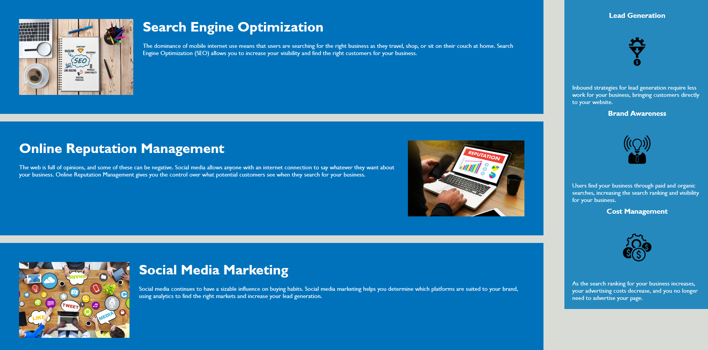

# MVR-bootcamp-challenge-1 Horiseon webpage

## Webpage Accessibility - Horiseon

This repository is to clean up and consolidate code for the purpose of improving optimization and accessibility standards.  This project was built to meet the needs of the marketing agency client, Horiseon, request of leaving their website code in a better state for future operations.  This solves the issue of updating outdated code in favor of new and semantic elemnts of HTML with CSS selectors favored ion search engine optimization.  This repositorty now more optimized and has corrected non-functional links.

## Usage

Horiseon webpage; to use clink on links in top navigation bar to be redireced to applicable information

## MIT License

Copyright (c) 2023 vrich88

Permission is hereby granted, free of charge, to any person obtaining a copy
of this software and associated documentation files (the "Software"), to deal
in the Software without restriction, including without limitation the rights
to use, copy, modify, merge, publish, distribute, sublicense, and/or sell
copies of the Software, and to permit persons to whom the Software is
furnished to do so, subject to the following conditions:

The above copyright notice and this permission notice shall be included in all
copies or substantial portions of the Software.

THE SOFTWARE IS PROVIDED "AS IS", WITHOUT WARRANTY OF ANY KIND, EXPRESS OR
IMPLIED, INCLUDING BUT NOT LIMITED TO THE WARRANTIES OF MERCHANTABILITY,
FITNESS FOR A PARTICULAR PURPOSE AND NONINFRINGEMENT. IN NO EVENT SHALL THE
AUTHORS OR COPYRIGHT HOLDERS BE LIABLE FOR ANY CLAIM, DAMAGES OR OTHER
LIABILITY, WHETHER IN AN ACTION OF CONTRACT, TORT OR OTHERWISE, ARISING FROM,
OUT OF OR IN CONNECTION WITH THE SOFTWARE OR THE USE OR OTHER DEALINGS IN THE
SOFTWARE.
